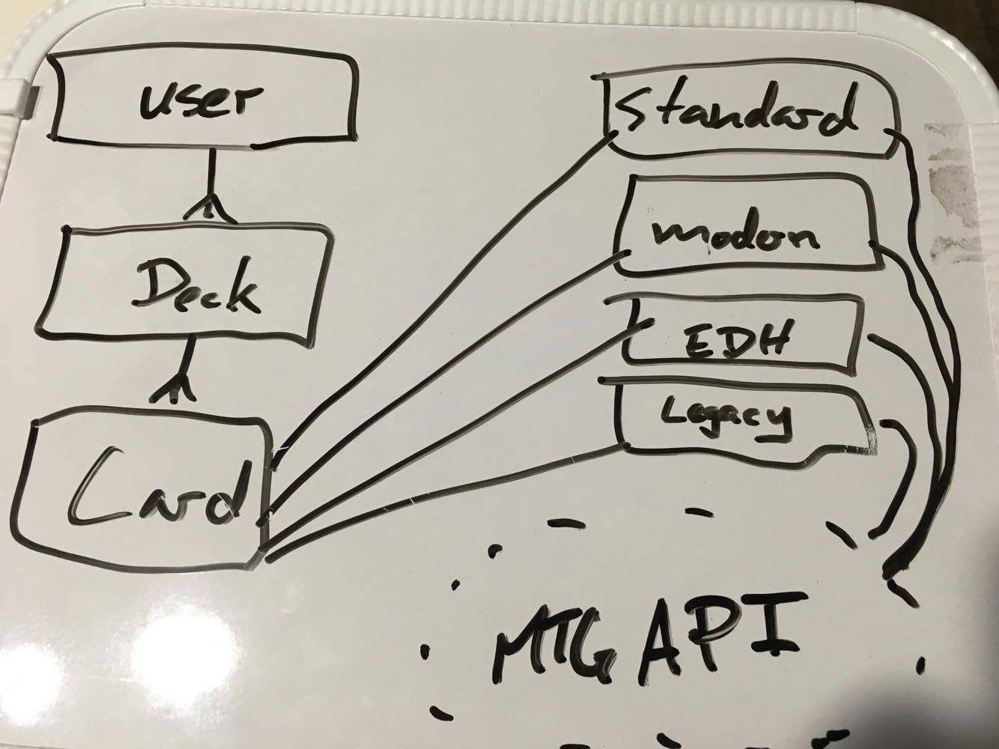
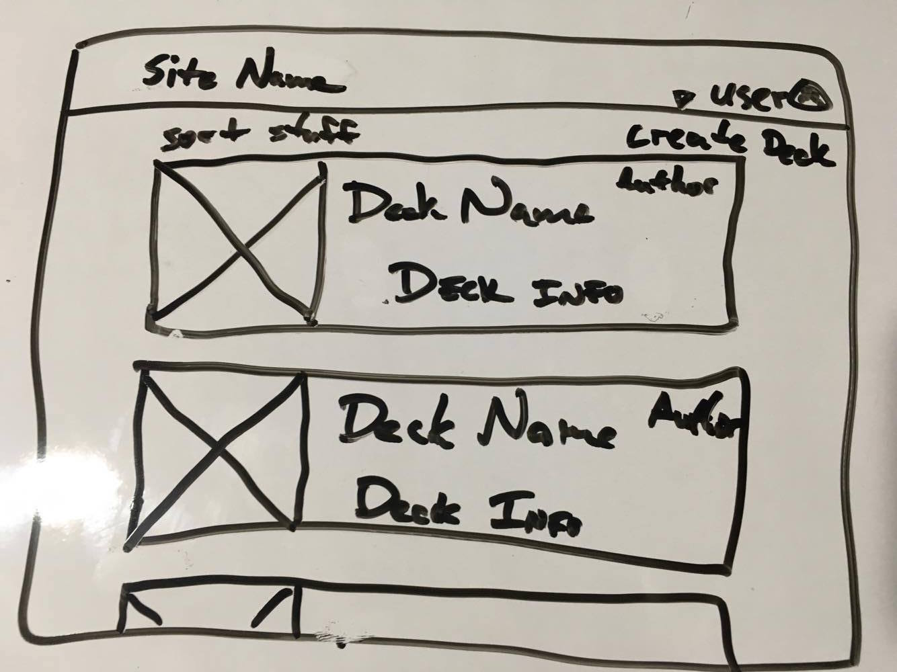
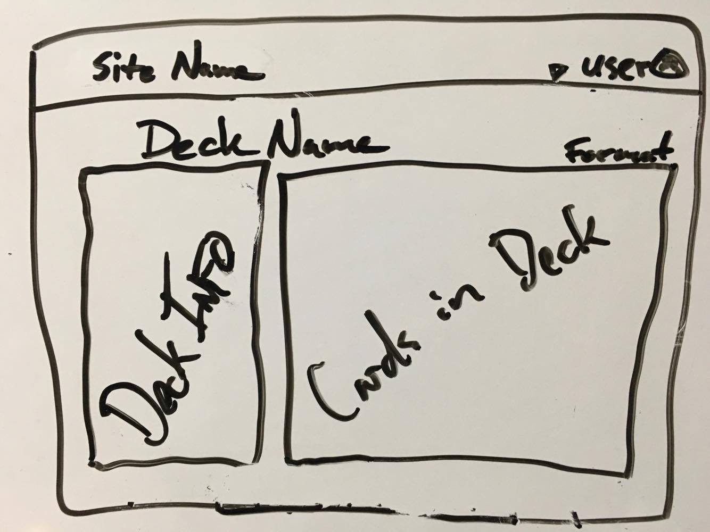
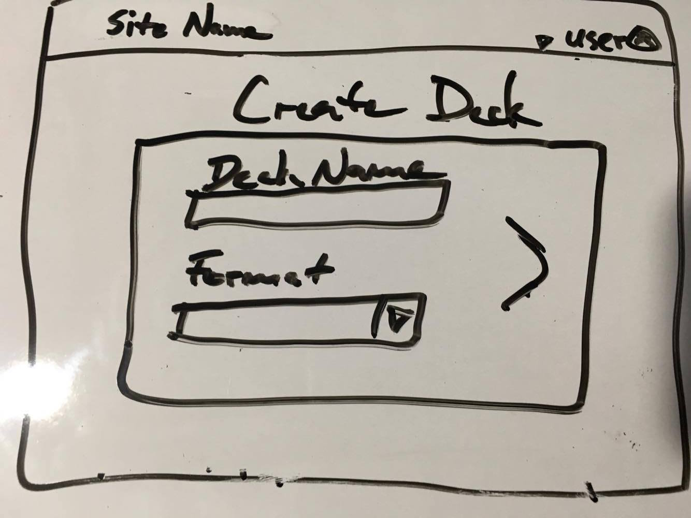
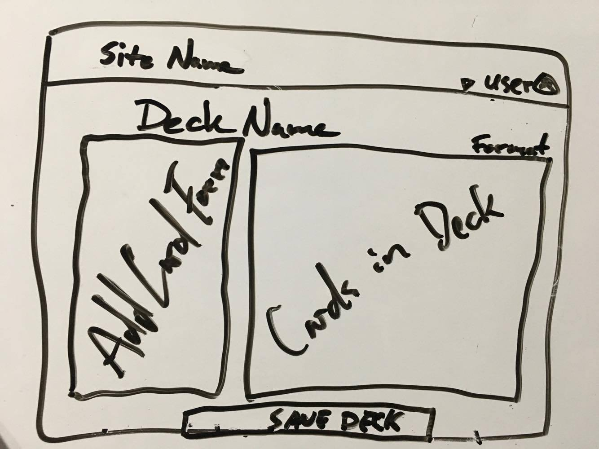

# 04_MTG

## Revisiting Project 2  
It's been a long time since our second project and I feel like now I can actually get closer to building what I wanted to build.  I will be focusing on a site that will help players of all skill levels of magic make better decks.  It's a subject I am very familiar with and something I really want to use. I couldn't really think of anything else I could work on that I would put the same amount of effort into.

## Technologies used  
### MERN Stack  
>* Mongoose/MongoDB  
>* Express Routing  
>* React Frontend Framework  
>* Node.js  

### [MTG API](https://docs.magicthegathering.io/)

## Approach  
I went into this project feeling pretty confident in my react skills.  After successfully setting up my back end I dove a little deeper into react and especially into redux which is a change from using an MVC model.  This was much more complicated than first thought.  Hoping something will be done by Friday to show.

## Major Hurdles
**Redux**

## Resources

### [Trello](https://trello.com/b/JZxH24hz)

### ERD Diagram  

### Wireframes
Main list of decks on site
  
Viewing a deck
  
Create a new deck
  
Edit a deck
  

